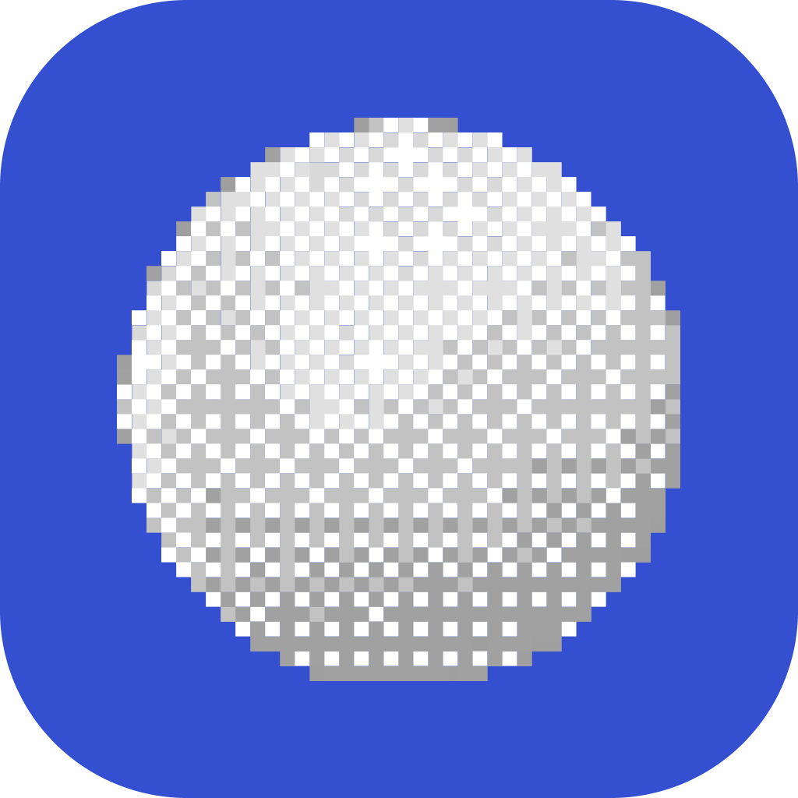

<div align="center">
    
    <h1>Dithra</h1>
    <p>
        Apply dithering effects to your images with ease.
        <br>
        A fun tool to mess around with images and create cool pixel effects.
    </p>
    <p>
        <a href="https://github.com/IlasDev/Dithra/actions"></a>
        <a href="https://developer.android.com"></a>
        <a href="https://kotlinlang.org"></a>
        <a href="LICENSE"></a>
    </p>
</div>

## Downloads

The easiest way to download Dithra is by grabbing the latest release directly from GitHub or by adding it to Obtainium. 

<div align="center">
  <a href="https://github.com/IlasDev/Dithra/releases/latest"></a>
  <a href="https://apps.obtainium.imranr.dev/redirect?r=obtainium://app/%7B%22id%22%3A%22dev.ilas.dithra%22%2C%22url%22%3A%22https%3A%2F%2Fgithub.com%2FIlasDev%2FDithra%22%2C%22author%22%3A%22IlasDev%22%2C%22name%22%3A%22Dithra%22%2C%22preferredApkIndex%22%3A0%2C%22additionalSettings%22%3A%22%7B%5C%22includePrereleases%5C%22%3Atrue%2C%5C%22fallbackToOlderReleases%5C%22%3Atrue%2C%5C%22filterReleaseTitlesByRegEx%5C%22%3A%5C%22%5C%22%2C%5C%22filterReleaseNotesByRegEx%5C%22%3A%5C%22%5C%22%2C%5C%22verifyLatestTag%5C%22%3Afalse%2C%5C%22sortMethodChoice%5C%22%3A%5C%22date%5C%22%2C%5C%22useLatestAssetDateAsReleaseDate%5C%22%3Afalse%2C%5C%22releaseTitleAsVersion%5C%22%3Afalse%2C%5C%22trackOnly%5C%22%3Afalse%2C%5C%22versionExtractionRegEx%5C%22%3A%5C%22%5C%22%2C%5C%22matchGroupToUse%5C%22%3A%5C%22%5C%22%2C%5C%22versionDetection%5C%22%3Atrue%2C%5C%22releaseDateAsVersion%5C%22%3Afalse%2C%5C%22useVersionCodeAsOSVersion%5C%22%3Afalse%2C%5C%22apkFilterRegEx%5C%22%3A%5C%22%5C%22%2C%5C%22invertAPKFilter%5C%22%3Afalse%2C%5C%22autoApkFilterByArch%5C%22%3Atrue%2C%5C%22appName%5C%22%3A%5C%22Dithra%5C%22%2C%5C%22appAuthor%5C%22%3A%5C%22IlasDev%5C%22%2C%5C%22shizukuPretendToBeGooglePlay%5C%22%3Afalse%2C%5C%22allowInsecure%5C%22%3Afalse%2C%5C%22exemptFromBackgroundUpdates%5C%22%3Afalse%2C%5C%22skipUpdateNotifications%5C%22%3Afalse%2C%5C%22about%5C%22%3A%5C%22%5C%22%2C%5C%22refreshBeforeDownload%5C%22%3Afalse%7D%22%2C%22overrideSource%22%3A%22GitHub%22%7D"></a>
</div>

## Features

- **Classic dithering algorithms** - Includes Floyd-Steinberg, Atkinson, Bayer patterns, and more.
- **Retro color palettes** - Emulate the Commodore 64, Game Boy, CGA, or create custom palettes.
- **Live preview** - See your changes in real-time as you tweak settings.
- **Export options** - Save your creations as PNG or SVG files with transparency support.

## Screenshots

<details>
<summary>Click to view screenshots</summary>

<br>

<div align="center">
  
  
</div>

</details>

## Development

Requires Android Studio and SDK 24+. To build the project locally, run the following commands in your terminal:

```bash
git clone https://github.com/IlasDev/Dithra.git
cd Dithra
./gradlew assembleDebug
```

## Contributing

Found a bug or want to add a feature? Community contributions are highly encouraged. Feel free to open an issue or submit a pull request!

## License

All code is licensed under the MIT License - do whatever you want with it. See [LICENSE](LICENSE) for details.